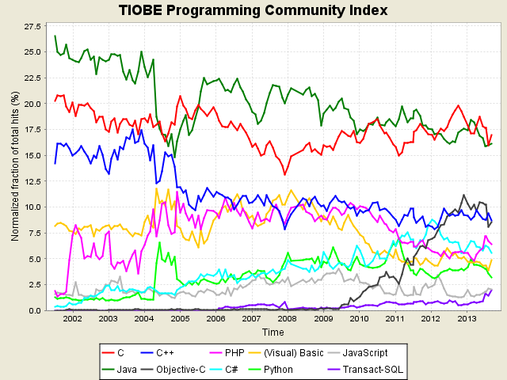
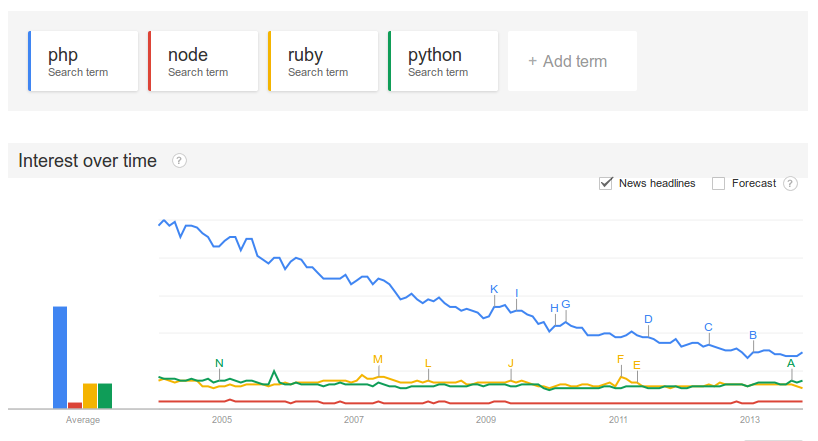
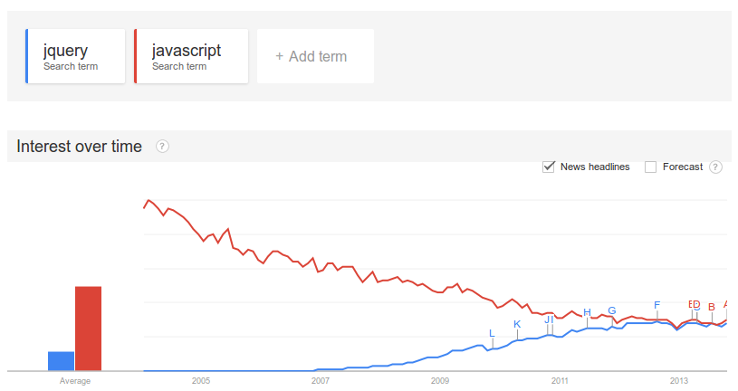
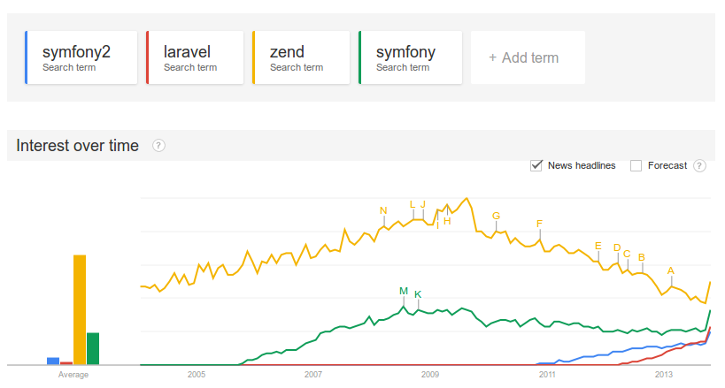
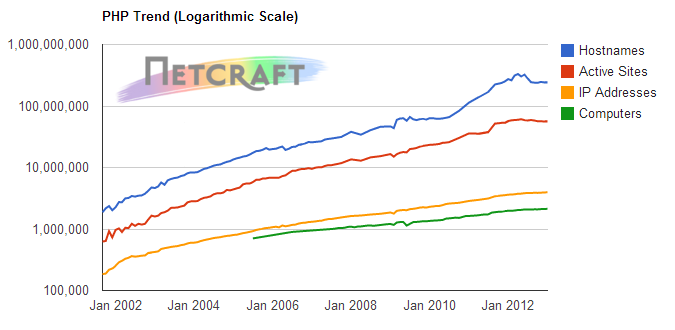
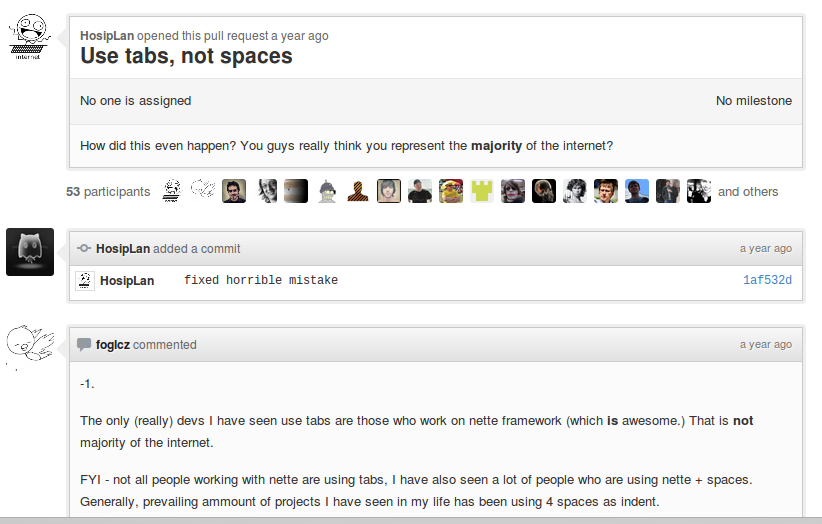

I presented this at [Tech4Africa 2013][20]. The slides can be found [here][21].

Quick History of PHP
====================

PHP was initially created by Rasmus Lerdorf when he got irritated by repetitive coding of CGI calls. He consolidated a number of
functions into a C library and created a parser which would call these functions out of HTML. And so PHP was born! Versions
2 and 3 were formalizations and extensions of the libraries, still using Rasmus' parser.

The Zend Engine replaced Rasmus' parser for version 4, introducing OOP capabilities, and in Version 5 Zend Engine 2 was
introduced. Recent versions of PHP saw even more improvements, most notable namespaces in 5.3 and a built in web server
and traits in 5.4

There's no ideology or design philosophy, except that it should be a [simple tool to solve problems][4].

> "I've never thought of PHP as more than a simple tool to solve problems"
>
>   [Rasmus Lerdorf 2010][6]

Lies, Damned Lies and ...
=========================



Despite a worsening reputation, the language hasn't decreased in popularity.



Less searches are being done for PHP.



If you look at the JavaScript vs JQuery trends, JavaScript is also decreasing, but JQuery is increasing. It seems like
the programming community is realising that frameworks are a good idea.



So if you look at PHP frameworks, searches on them are also increasing, especially after 2013 when Zend 2 and Symfony 2
were released.



No shortage of hosts offering PHP.

Who uses it?
============

* User facing portion of Facebook through HipHop PHP (which generates C++)
* Wordpress - Application turned framework
* Yahoo (for now). They are replacing it with Node.
* Wikipedia / Mediawiki

Embrace the Cactus
==================

It's easy to create insecure / buggy code in PHP:

```php
    mysql_query("SELECT * FROM `users` WHERE `username` = $_GET['username']");
```

PHP accounts for only 18% of applications covered by the <abbr class="Common Vulnerabilities and Exposures">[CVE][14]</abbr>, but accounts for almost 29% of the  vulnerabilities

It's developed a bad reputation in the programming community:

> Bringing a knife to a gun fight is like bringing PHP to a modern web stack.
>
>   [@iamdevloper][7]

Settings such as `register_globals` and `magic_quotes` that defaulted to `on` opened up a lot of security holes

No unified community. In general, the community is great. In the rare cases where the PHP documentation (or even the language) is insufficient,
you can usually find something of value in the comments. Yet, there is a lot of conflict in both the official (like PHP internals) and
the unofficial (like [PHP-FIG][1]) communities.

If you look at the debate on what to use for indentation, [tabs][2] vs [spaces][3], the community is in total disarray.



Inconsistencies in naming functions:

```php
strrev     // String Function
str_repeat // String Function
explode    // String Function
// At least somewhat consistent
strpos($haystack, $needle)
array_key_exists($needle, $haystack)
```

Object Oriented, or just Object Capable? - [Michael Kimsal][8]

So you can do Object Oriented Programming as well as Procedural and Functional Programming in PHP (especially PHP 5.3 and later).

See you on the flip side...
===========================

PHP 5.3
-------

PHP 5.3 is for me a watershed version on PHP's history - It introduced a number of features / capabilities that made it possible
for some of the other factors I'll mention to come into existence. The most notable feature is namespaces, making it easier
to name classes in a sane way. A lot of people welcomed the introduction of lambda functions and closures.

I think the PHP developers and community realized that PHP was becoming outdated and had a lot of valid issues that needed
to be addressed. For me 5.3 was a definite step in the right direction. It introduced (amongst other things):

* Namespaces
* Closures and Lambda functions

PHP-FIG
-------

Although it seems to generate a lot of conflict, the PHP-FIG has managed to at least get the different frameworks talking.
It's an unofficial (as in not sponsored by PHP) group formed by various frameworks and projects whose aim it is to get
the projects talking and to find ways to work together. It's not always plain sailing, but it seems to get to valuable
decisions. Eventually.

* [PSR-0][9] has enabled the creation of packaging software such as composer / packagist
* [PSR-1][16] and [PSR-2][17] generated a lot of conflict, but at least all of the participating frameworks partially agreed on coding standards
* [PSR-3][18] and [PSR-4][19] aren't momentous decisions, but they at least pave the way forward for increased collaboration

Packagist / Composer
--------------------

[Composer][11] is a tool to manage dependencies for a project, and manages and installs dependencies on a per project
basis. Very much on par with node's npm and ruby's bundler. [Packagist][10] is a repository for composer packages and
makes it dead simple to find a package / library that will address your specific need. Before this, we had PEAR, but
that was usually a headache to set up and version properly locally, not to mention on a shared host.
Now it's as simple as doing

```bash
    composer require "vendor/library"
```

To a certain extent the improvements in PHP 5.3 and some of the work from PHP-FIG made this possible, although composer
could have existed without them.

Modern Frameworks
-----------------

The combination of PHP 5.3 (specifically namespaces and proper OO support), the work of the PHP-GIH and the development
of Composer made it possible to not only create frameworks such as Symfony2, Zend2 and Laravel, but also to reuse components
from these frameworks in other projects. Drupal 8 uses a lot of Symfony2's components. PPI is a framework built using
both Zend2 and Symfony2 components. You can now easily choose and combine libraries without having to manage class names
or dependencies. This has at least two direct advantages for project developers:

1. Instant access to a whole range of precoded, quality, libraries.
2. No more wasting time on managing dependencies and name clashes.

So, Slum or Diamond in the Rough?
=================================

> Good systems cater for users' mistakes, great systems also cater for developers' mistakes...
>
>   [Jrgns][12]

My opinion is, there is no right answer. To a certain extent, PHP can be described as a horrible language that makes it
very easy to introduce bugs and security issues. It doesn't give you guidance on how to do anything, and can't seem to
decide if it's procedural or object oriented. In the same breath, it gives you a lot of freedom to code according to your
style, and makes a lot of common coding tasks very easy to do. Successful business have been built and are still running
on PHP.

If you've never coded anything but PHP and have no formal programming education (including good programming books), you're
probably coding crappy PHP. Probably. I'd suggest you start reading up on good programming practices, start reading code
that's of a high quality, and start learning other programming languages, especially stricter ones like Java, or start
using frameworks such as Symfony2 and Laravel that at least guides you in the right direction. Speaking multiple natural
languages keeps your brain sharp and young. Coding in [multiple languages][5] makes you a better coder.

If you know what you're doing and you perhaps have some extra experience in a more structured language such as Java or Ruby,
you're probably coding quality PHP. It's un-opinionated, so, as long as you know what you're doing, it can be a great tool.
Don't discount the language just because it's lost it's coolness factor. You can write quality code in PHP.


> If you can pull it off, you’re badass as hell, but most of the time you’re only going to end up stabbing yourself.
>
>   [ohpalmer][13]

[1]: http://www.php-fig.org/
[2]: http://philsturgeon.co.uk/blog/2013/04/psr2-the-tough-decision
[3]: https://github.com/php-fig/fig-standards/pull/35
[4]: http://toys.lerdorf.com/archives/38-The-no-framework-PHP-MVC-framework.html
[5]: http://www.sciencemag.org/content/330/6002/332.summary
[6]: https://twitter.com/rasmus/status/1938080214814720
[7]: https://twitter.com/iamdevloper/status/380285502580338688
[8]: http://michaelkimsal.com/blog/php-is-not-object-oriented/
[9]: https://github.com/php-fig/fig-standards/blob/master/accepted/PSR-0.md
[10]: https://packagist.org/
[11]: http://getcomposer.org/
[12]: https://twitter.com/jrgns/status/365357629469499392
[13]: https://twitter.com/ohpalmer/status/380290678502461440
[14]: http://www.coelho.net/php_cve.html
[15]: http://www.tiobe.com/index.php/content/paperinfo/tpci/index.html
[16]: https://github.com/php-fig/fig-standards/blob/master/accepted/PSR-1-basic-coding-standard.md
[17]: https://github.com/php-fig/fig-standards/blob/master/accepted/PSR-2-coding-style-guide.md
[18]: https://github.com/php-fig/fig-standards/blob/master/accepted/PSR-3-logger-interface.md
[19]: https://github.com/php-fig/fig-standards/blob/master/proposed/psr-4-autoloader/psr-4-autoloader.md
[20]: http://www.tech4africa.com
[21]: http://jrgns.net/talks/phpslums
